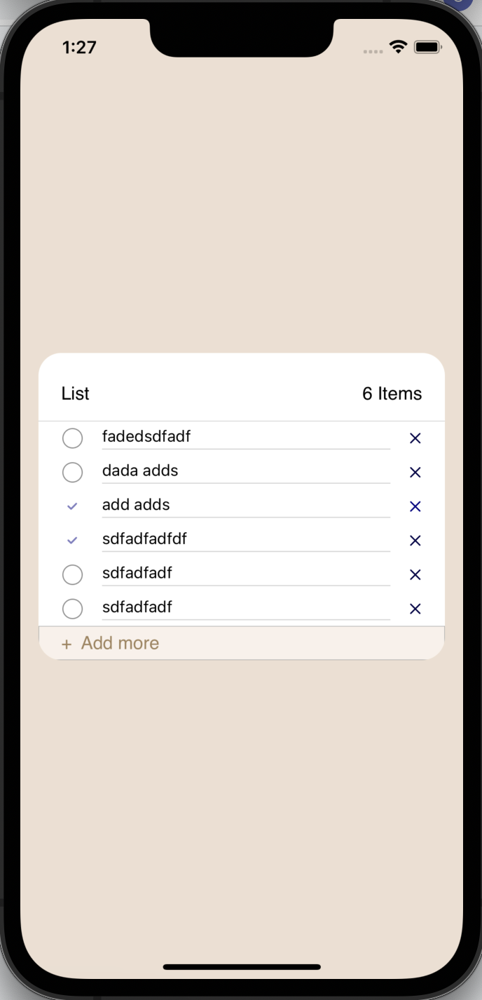
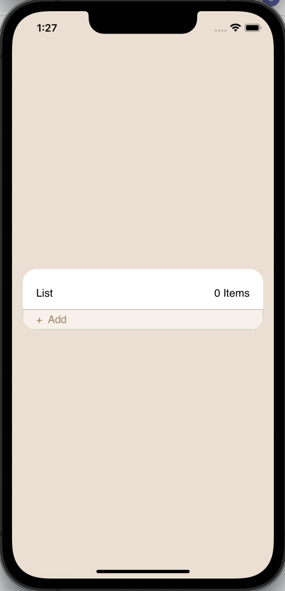

# Items Listing Demo Project

The purpose of this demo project is to create and design a project where there is a header which shows list title and count of items. Secondly it contains a list of added items. If there is no items it shows header and add button. In the last it had a add button for adding items. As we add items it dynamically keeps growing. Furthermore each item has a checkbox, item title and cross button. User can check and uncheck the item and also delete it if user wants to. 

## Screenshots

  
  

## Features

- Add Items
- Delete Items
- Check and Uncheck Items

## Swift UIKit Concepts

- UITableView
- UIStackView
- Views
- Storyboard
- Controller

## Architecture

- MVVM

## Author

- [@shamkumar](https://github.com/ShamKumarS)

## 🔗 Links

